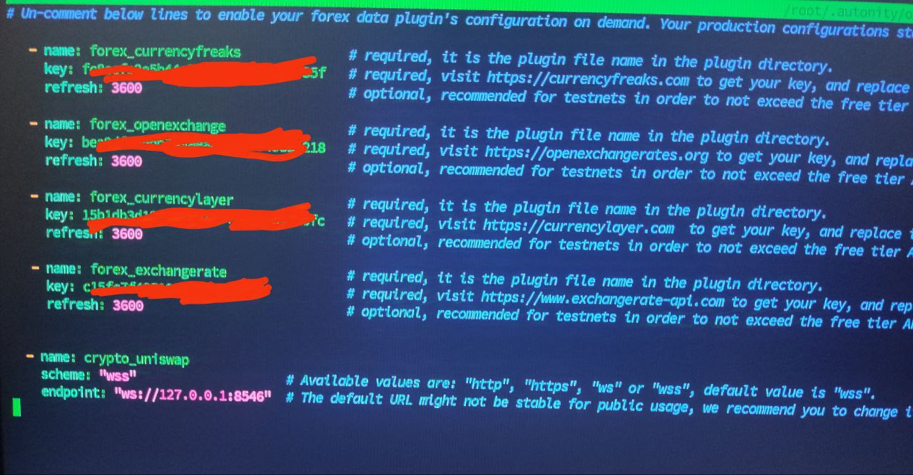

# Autonity Piccadilly Testnet Setup

### Registration

To enter the Tiber Challenge, complete the registration form at [Tiber Challenge Registration](http://tiber.autonity.org/). After registering, your participant's Registered Address will be funded with the following:

| Asset                                   | Amount           |
|-----------------------------------------|------------------|
| ATN on Piccadilly                       | 1                |
| NTN on Piccadilly                       | 0                |
| Test USDCx on Piccadilly                | 1000             |
| Test USDC on Polygon Amoy Testnet       | 25               |
| Test POL on Polygon Amoy Testnet       | 0.01             |

For more details about the challenge, please visit the [Tiber Repository](https://github.com/autonity/tiber-challenge).

### Terms and Conditions
The challenge's terms and conditions can be found [here](https://gateway.pinata.cloud/ipfs/Qmcdza1BscJFAr2ubkJ2WEksqG8e3gc3XAVpwR83xNY39g).

## Resources

- **Official Documentation**: [Autonity Documentation](https://docs.autonity.org/)
- **GitHub Repositories**: [Autonity GitHub](https://github.com/autonity/)
- **Network Explorer**:
  - [Piccadilly](https://piccadilly.autonity.org/)
  - [Bakerloo](https://bakerloo.autonity.org/)
- **Validator Explorer**:
  - [Stakeflow](https://stakeflow.io/autonity-piccadilly)
  - [autland](https://autland.io/)
  - [Daic.capital](https://autonity.daic.capital/)
- **RPC List**: [Chainlist](https://chainlist.org/?testnets=true&search=piccadilly)

---

## Node Installation

### 1. Preparing Server

#### Hardware Requirements

For detailed hardware requirements, refer to [Hardware Requirements](hardware_requirements.md).

### 2. Install Prerequisites

Run the following commands to install the required tools:

```bash
sudo apt-get update && sudo apt-get upgrade -y
sudo apt install curl git jq expect ufw -y
```

Clone the Autonity repository and install:

```bash
git clone https://github.com/adanothe/autonity.git
cd autonity
chmod +x install.sh
bash install.sh
```

- During installation, provide the password for the wallet.

### 3. Create Wallet

Create wallets for the validator:

```bash
autonity wallet
```

1. Choose **"Create Wallet"** and create wallets named `oracle` and `treasury`.
2. Export the private key for the `oracle` wallet:
   - Select **"Export Private Key"** and save the file as `oracle.key`.
3. Note:
   - **`treasury.key`**: Used for transactions, validator lifecycle, and staking rewards.
   - **`oracle.key`**: Used to sign price report transactions sent to the Oracle Contract. Ensure it is funded to avoid gas issues.

---

## Running the Node

To manage your node, use the following commands:

```bash
autonity node start               # Start the node
autonity node logs                # View node logs
autonity node sync                # Check sync status
autonity node restart             # Restart the node
autonity node stop                # Stop the node
autonity node update              # Update the node
```

---

## Setting Up Oracle Server

### 1. Ensure Node Sync

Check if your node is synced:

```bash
autonity node sync
```

### 2. Fund the Oracle Wallet

Fund the `oracle.key` wallet with ATN by using the `autonity wallet` command and selecting the "tx" menu.

### 3. Configure Plugins

Edit the `plugins-conf.yml` file to configure plugins. Obtain API keys from:

- [CurrencyFreaks](https://currencyfreaks.com)
- [OpenExchangeRates](https://openexchangerates.org)
- [CurrencyLayer](https://currencylayer.com)
- [ExchangeRate-API](https://www.exchangerate-api.com)

Edit the configuration:

```bash
nano $HOME/.autonity/oracle/plugins-conf.yml
```

**Example Configuration**:  


---

## Running Oracle Server

To manage the Oracle server, use the following commands:

```bash
autonity oracle start          # Start Oracle server
autonity oracle logs           # View Oracle logs
autonity oracle restart        # Restart Oracle server
autonity oracle stop           # Stop Oracle server
autonity oracle update         # Update Oracle server
```

---

## Register Validator & Management

### 1. Create a Validator

Register as a validator:

```bash
autonity validator setup
```

Follow the prompts to set up your validator.

### 2. Validator Management

Use the `autonity validator` command for validator management:

```bash
autonity validator <subcommands>
```

Available subcommands:

- **`setup`**: Set up a validator.
- Options: Create Validator, Bond/Unbond, Pause/Reactivate, Change Commission Rate
- **`info`**        : Display validator information.
- **`list`**        : List all validators.
- **`seat active`** : Check for active seats.
- **`committee`**   : Check if your validator is in the active committee.

### Other Commands autonity

- **`validator`** : Validator management
- **`wallet`**    : Wallet management
- **`node`**      : Node management
- **`oracle`**    : Oracle server management
- **`swap`**      : On-chain swap
- **`help`**      : Display help menu

For more details, run:

```bash
autonity help
```

---