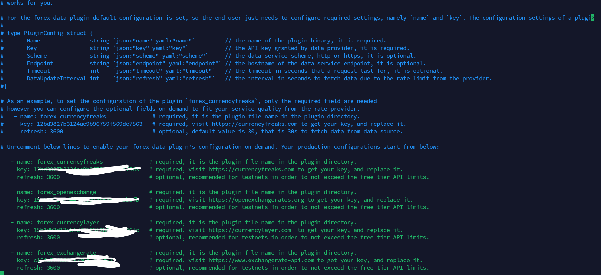

# Setup Autonity Piccadilly Testnet & Join Autonity Piccadilly Circus Games Competition (PCGC)

- **Official Docs**: [Autonity Documentation](https://docs.autonity.org/)
- **Autonity GitHub**: [GitHub Repositories](https://github.com/autonity/)
- **Network Explorer**:
  - [Piccadilly](https://piccadilly.autonity.org/)
  - [Bakerloo](https://bakerloo.autonity.org/)
- **Validator Explorer**:
  - [Stakeflow](https://stakeflow.io/autonity-piccadilly)
  - [Daic.capital](https://autonity.daic.capital/)
- **PCGC website**: [PCGC website](https://game.autonity.org/)

## Node Installation

### Preparing Server Requirements

#### Hardware

For detailed hardware requirements for running Autonity Go Client and Autonity Oracle Server, please refer to [Hardware Requirements](hardware_requirements.md).

#### Install Server Prerequisites & Tools

```shell
sudo apt-get update && sudo apt-get upgrade -y
sudo apt install curl git jq expect fail2ban ufw -y
```

```sh
curl -sO https://raw.githubusercontent.com/adanothe/autonity/main/install.sh && \
chmod +x install.sh && \
bash install.sh 
```
> **Note:**
> If you have already created a validator in a previous round, you can choose "Use Existing Validator" during installation.
> After installation, you must move the backup data of the validator, specifically `oracle.key` and `treasury.key` to the directory `$HOME/.autonity/keystore` and `autonitykeys` to the directory `$HOME/autonity-chaindata/autonity`.

> **Important:**
> During installation, you will be asked to set a password for the key wallet. The password will be used to unlock the wallet and sign the transaction. The password you create will be saved in the **.env** file.
> Wallets are automatically created during installation, and keystores are saved in `$HOME/.autonity/keystore` **`PLEASE BACKUP`**.
>
> There are 3 wallets that were created:
> - `treasury.key`: serves as our treasury and is used by validators for various purposes, including sending transactions, managing validator lifecycle, and receiving staking rewards. It is also utilized for registration in the Piccadilly Circus Games Competition (PCGC).
> - `oracle.key`: functions as the cryptographic identifier for the Oracle server. It is employed to sign price report transactions sent to the on-chain Oracle Contract, with its address serving as a unique identifier for the Oracle server. To prevent transaction failures due to insufficient gas, it is essential to pre-fund your Oracle.key account before initiating transactions for online price report data. Be sure to keep your Oracle wallet sufficiently funded!
> - `autonitykeys`: On starting, by default AGC will automatically generate an `autonitykeys` file containing your node key and consensus key within the `autonity` subfolder of the `--datadir` specified when running the node. These are located in the directory `$HOME/autonity-chaindata/autonity/` and play a crucial role in forming validator addresses and enodes. Additionally, they include the private key for gossip transactions among network nodes and the consensus key for participating in consensus as a validator.
>
> To backup all wallets, run the command `autonity wallet management` and choose option 4.

## Running Node

```bash
autonity node start               # Start Node
autonity node logs                # Check Node logs
autonity node sync                # Check node sync
autonity node restart             # Restart node
autonity node stop                # Stop node
autonity node update              # Update node
```

## Register for Piccadilly Circus Games Competition
To sign up and take part, just [Complete the Registration Form](https://game.autonity.org/getting-started/register.html). Then run this command to get autonity address and signature: choose option 1
```bash
autonity wallet management
```
> **Note:**
> If you have participated in the previous round, you do not need to register again.

> **Important:**
> Registered game participants will receive basic ‘get going’ funding of **1 ATN** and **1 NTN** to your participant account on-chain. As part of the game, registered game participants are automatically given an account funded with **1M fake USDC** in an off-chain exchange, the _Centralized Auton Exchange (CAX)_. This is your principal source of game funding for on-chain tasks.

## Setup Oracle Server

- Ensure your nodes are synced. To check if your node is synced, simply run `autonity node sync`. Pre-fund the oracle server account (`oracle.key`) with ATN. simply run `autonity wallet tx`
- Edit your oracle server data plugins config file `plugins-conf.yml` to specify the name and key for each plugin you are using. Get the API key on the following sites, please register and copy each API key.
  - [CurrencyFreaks](https://currencyfreaks.com)
  - [OpenExchangeRates](https://openexchangerates.org)
  - [CurrencyLayer](https://currencylayer.com)
  - [ExchangeRate-API](https://www.exchangerate-api.com)

```bash
nano $HOME/.autonity/oracle/plugins-conf.yml
```

<h3 align="center">Example</h3>

<p align="center">
  
</p>

## Running Oracle Server

```bash
autonity oracle start          # Start Oracle server
autonity oracle logs           # Check Oracle server logs
autonity oracle restart        # Restart Oracle server
autonity oracle stop           # Stop Oracle server
autonity oracle update         # Update Oracle server
```

## Validator Management & Register Validator for Piccadilly Circus Games Competition (PCGC)

### Create Validator

Choose option 1 to register as a validator

```bash
autonity validator setup
```

### Register Onboard Validator

Complete the [Register a Validator Form](https://game.autonity.org/awards/register-validator.html). Then run this command to get signature and enode:

```bash
autonity wallet management
```
Choose option 2 to create signature and get enode for validator registration.

### Autonity Validator Management

The `autonity validator` command provides a set of subcommands to manage validators within the Autonity network.

Usage: `autonity validator <subcommands>`

Below is the list of available subcommands:

- `setup`: Sets up a validator. You can choose from the following options:
  1. Create Validator
  2. Bond & Unbond Validator
  3. Pause & Reactivate Validator
  4. Change Commission Rate
  5. Migrate Validator
- `info`: Displays information about a validator.
- `list`: Lists all validators.
- `seat active`: Checks for active seats.
- `committee`: Checks if your validator is in the active seats.
- `help`: Displays help menu.

## Using CAX

Simply run the `autonity cax menu` command.

To see more commands, check [cheatsheet](cheatsheet.md), or run the following command:

```bash
autonity help
```
