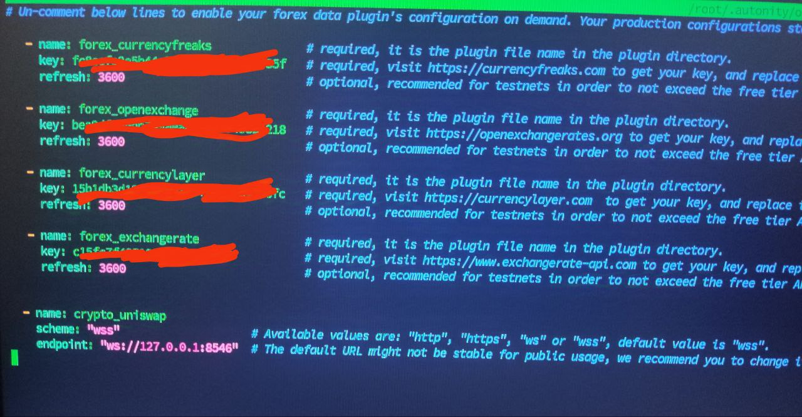

# Autonity Piccadilly Testnet Setup

- **Official Documentation**: [Autonity Documentation](https://docs.autonity.org/)
- **Autonity GitHub Repository**: [GitHub Repositories](https://github.com/autonity/)
- **Network Explorer**:
  - [Piccadilly](https://piccadilly.autonity.org/)
  - [Bakerloo](https://bakerloo.autonity.org/)
- **Validator Explorer**:
  - [Stakeflow](https://stakeflow.io/autonity-piccadilly)
  - [Daic.capital](https://autonity.daic.capital/)
- **RPC List**: [Chainlist](https://chainlist.org/?testnets=true&search=piccadilly)

---

## Node Installation

### 1. Preparing Server Requirements

#### Hardware Requirements

For detailed hardware requirements for running the Autonity Go Client and Autonity Oracle Server, refer to [Hardware Requirements](hardware_requirements.md).

### 2. Install Server Prerequisites & Tools

Run the following commands to install required tools:

```bash
sudo apt-get update && sudo apt-get upgrade -y
sudo apt install curl git jq expect ufw -y
```

Clone the Autonity repository and install:

```bash
git clone https://github.com/adanothe/autonity.git
cd autonity
chmod +x install.sh
bash install.sh
```

- During installation, provide the password to be used for the wallet.

### 3. Create Wallet

To create wallets for the validator, run the following command and follow the instructions:

```bash
autonity wallet
```

1. Select "Create Wallet" and create two wallets named `oracle` and `treasury`.
2. Export the private key for the `oracle` wallet:
   - Select "Export Private Key" and choose `oracle.key`. This will be used during the validator creation process.
3. Note the role of each key:
   - **`treasury.key`**: Used by validators for transactions, managing validator lifecycle, and receiving staking rewards.
   - **`oracle.key`**: Used to sign price report transactions sent to the Oracle Contract on-chain. Ensure the `oracle.key` account is sufficiently funded before submitting transactions to avoid gas issues.

---

## Running the Node

To manage your node, use the following commands:

```bash
autonity node start               # Start the node
autonity node logs                # View node logs
autonity node sync                # Check node sync status
autonity node restart             # Restart the node
autonity node stop                # Stop the node
autonity node update              # Update the node
```

---

## Setting Up Oracle Server

1. **Ensure Node Sync**: Check if your node is synced by running:

   ```bash
   autonity node sync
   ```

2. **Pre-fund the Oracle Server**: Fund the `oracle.key` wallet with ATN by using `autonity wallet` and selecting the "tx" menu.

3. **Configure Plugins**: Edit the `plugins-conf.yml` file to specify the name and key for each plugin you use. Obtain API keys from the following services:
   - [CurrencyFreaks](https://currencyfreaks.com)
   - [OpenExchangeRates](https://openexchangerates.org)
   - [CurrencyLayer](https://currencylayer.com)
   - [ExchangeRate-API](https://www.exchangerate-api.com)

Edit the configuration file:

```bash
nano $HOME/.autonity/oracle/plugins-conf.yml
```

**Example Configuration**:


---

## Running Oracle Server

To manage the Oracle server, use the following commands:

```bash
autonity oracle start          # Start Oracle server
autonity oracle logs           # View Oracle server logs
autonity oracle restart        # Restart Oracle server
autonity oracle stop           # Stop Oracle server
autonity oracle update         # Update Oracle server
```

---

## Register Validator & Validator Management

### 1. Create a Validator

To register as a validator, run:

```bash
autonity validator setup
```

Follow the prompts to set up your validator.

### 2. Validator Management

The `autonity validator` command provides subcommands to manage validators. Use the following structure:

```bash
autonity validator <subcommands>
```

Available subcommands:

- **`setup`**: Set up a validator. Options include:
  1. Create Validator
  2. Bond & Unbond Validator
  3. Pause & Reactivate Validator
  4. Change Commission Rate
- **`info`**: Display information about a validator.
- **`list`**: List all validators.
- **`seat active`**: Check for active seats.
- **`committee`**: Check if your validator is in the active committee.
- **`help`**: Display help menu.

For more details, check the [Cheatsheet](cheatsheet.md), or run:

```bash
autonity help
```